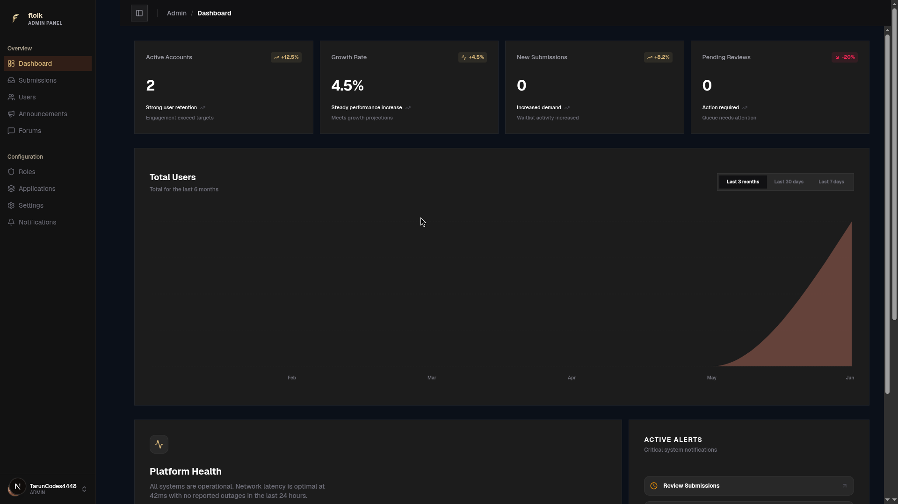
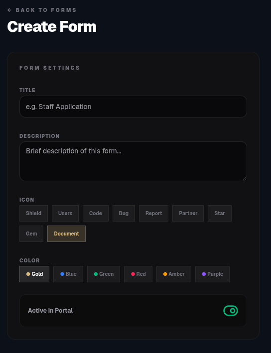
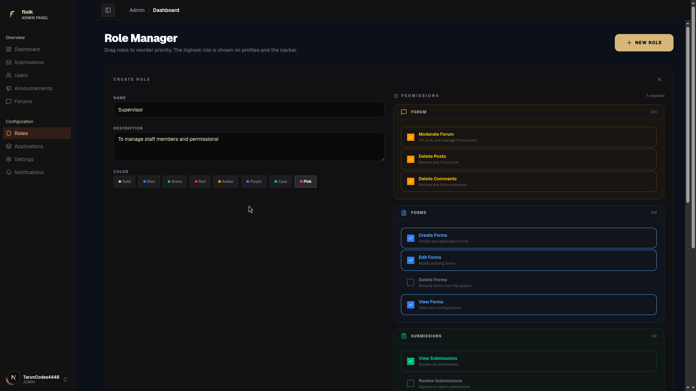
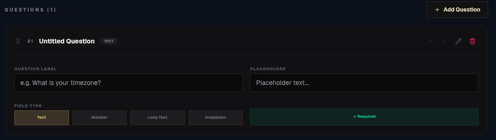

  

# Floik

Floik is a comprehensive, open source administration portal and community discussion system. Built as the successor to the NetherGames portal, Floik is specially designed for Minecraft servers, networks, and gaming communities to synchronize infrastructure, manage applications, and engage players.

  

## Overview

Minecraft communities need custom, integrated web hubs to link server settings, handle application forms, and host community discussions. Floik provides a unified dashboard that replaces proprietary portals, offering role-based access control, forum systems, and a dynamic forms renderer.

## Main Features

### 1. Dynamic Application Forms and Submissions
Staff, builder, and appeal forms can be dynamically configured and rendered. Administrators can view, filters, search, and approve submissions globally.

  

### 2. Discord-Inspired Role Manager
Prioritize staff hierarchies, portal permissions, and user ranks using a drag-and-drop system. Ranks synchronize across public profiles and comments.

  

### 3. Community Forum and Moderation
Moderators can pin important announcements, lock threads, filter inappropriate contents, and ban malicious actors in real time.

  

### 4. Player Profiles
Custom identity pages display user parameters, top role titles with custom badges, avatar cards, and comment histories.

---

## Technical Component Architecture

The codebase is organized into modules to support backend logic and frontends separately:

* **[floik_api](file:///home/taruncodes/Documents/Startups/floik/floik_api)**: The Prisma-connected Node Express API server that manages permission controllers, submission states, and community endpoints.
* **[floik_web](file:///home/taruncodes/Documents/Startups/floik/floik_web)**: The Next.js web application representing the admin panel and portal page views.
* **[floik_landing](file:///home/taruncodes/Documents/Startups/floik/floik_landing)**: The public Next.js marketing and presentation site.

---

## Full Documentation

Explore deep-dive guides for setting up and hosting your own instance:

* [Onboarding Guide](file:///home/taruncodes/Documents/Startups/floik/docs/get-started.md): Installation prerequisites, initial config steps, and database migrations.
* [System Architecture](file:///home/taruncodes/Documents/Startups/floik/docs/architecture.md): Database schemas, user junction structures, and module designs.
* [API Reference](file:///home/taruncodes/Documents/Startups/floik/docs/api-reference.md): Endpoint lists, request bodies, and authentication security scopes.
* [Self Hosting Guide](file:///home/taruncodes/Documents/Startups/floik/docs/self-hosting.md): Production setup variables, cookie tracking, and Nginx proxy setups.

---

## Community Policies

* To contribute fixes, optimizations, or feature expansions, read our [Contributing Guide](file:///home/taruncodes/Documents/Startups/floik/CONTRIBUTING.md).
- To report abuse or review community behaviors, read our [Code of Conduct](file:///home/taruncodes/Documents/Startups/floik/CODE_OF_CONDUCT.md).
* This project is open for extension and modification under the [MIT License](file:///home/taruncodes/Documents/Startups/floik/LICENSE).
